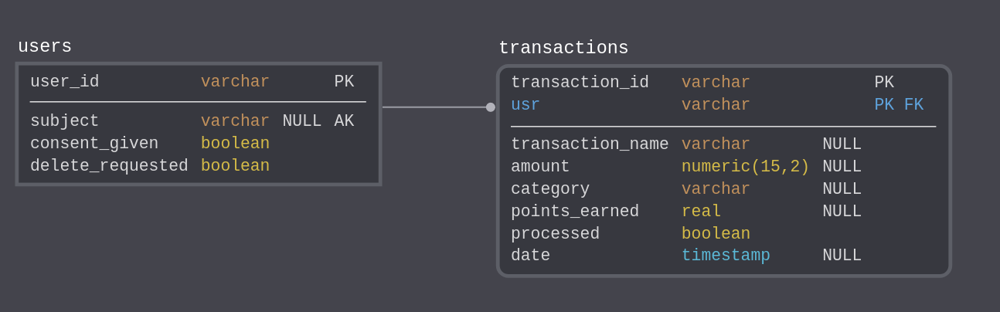
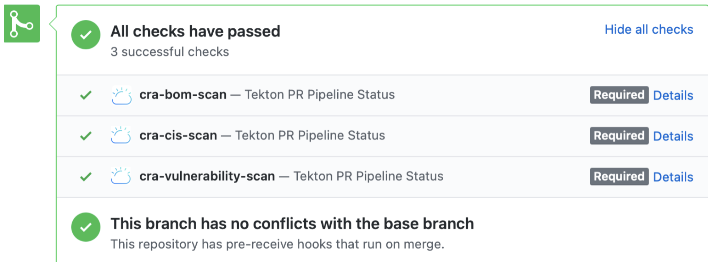
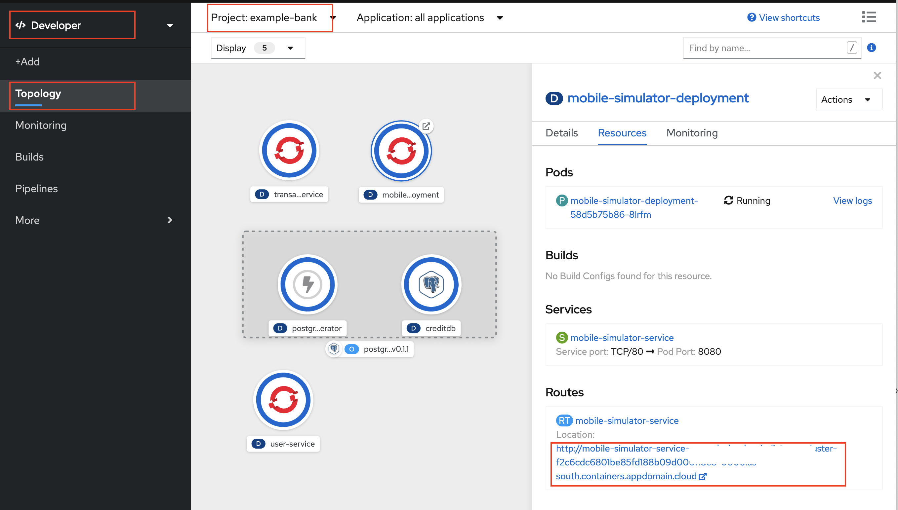
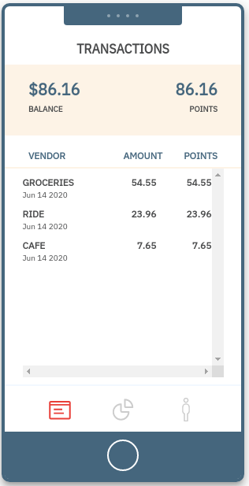
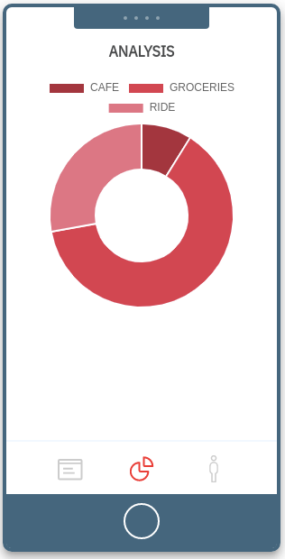
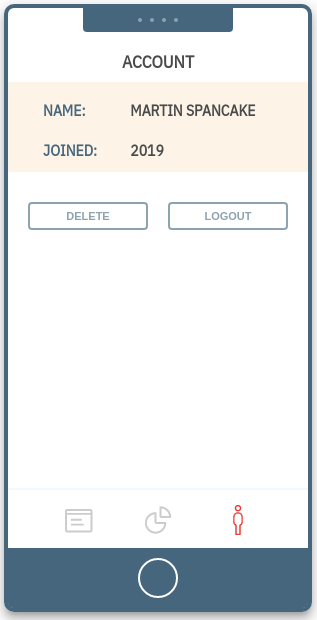

# Using IBM Code Risk Analyzer with IBM DevOps Toolchains and OpenShift 

In this code pattern, we show how to deploy a microservices based back-end in OpenShift 4.5 using IBM Cloud Toolchain CI/CD service. As part of the release of IBM Cloud for Financial Services (link tbd) support for containerized applications, this code pattern shows how to use IBM Toolchain to create a Tekton pipeline that integrates IBM Code Risk Analyzer (CRA), IBM Container Registry and Vulnerability Advisor. CRA runs an infrastructure and deployment artifact scan against your GitHub repository as part of the an overall DevSecOps system.

## About Application

As people become more aware of data and concerned about their online privacy, regulations around the world have started requiring software projects to think about how customers' data is handled.  This pattern deploys a set of microservices to act as a back-end for a mobile bank application, such as those often used by businesses who want to better understand how people use their services by collecting data.

We have implemented a few important data privacy features inspired by real data privacy regulations:

* Authorization verification with IBM App ID. Read [here]() to understand how App ID is used for user authentication in this code pattern.

* Consent for data collection - requiring users to 'opt-in' requirement.

It also uses the following components of the Financial Services cloud-native best practices for containerized workloads for DevSecOps toolchain. 

* Scan deployment artifats like Dockerfiles, package manifests, and deployment yamls with IBM Code Risk Analyzer.
* Use IBM Container Registry as private registry.
* Show how Security and Compliance Center helps identify vulnerabilities in the container registry.
* Deploy via IBM Cloud toolchain(tekton pipeline) to OpenShift (ROKS) on VPC.

# Architecture

The example bank system includes several microservices for handling user authentication and transaction mechanics. 


# Deployment pipeline

The deployment pipeline uses the IBM Cloud Toolchain to create a PR (pull request) pipeline and a CD (continuous delivery) pipeline.


## Included Components

- [IBM Managed OpenShift on VPC](https://www.ibm.com/cloud/openshift)
- [OpenLiberty](https://openliberty.io)
- [App ID](https://www.ibm.com/cloud/app-id)
- [Code Risk Analyzer](https://www.ibm.com/cloud/blog/announcements/find-source-code-vulnerabilities-with-code-risk-analyzer)
- [IBM Cloud Toolchain](https://www.ibm.com/cloud/architecture/toolchains/)
- [IBM Vulnerability Advisor](https://cloud.ibm.com/docs/Registry?topic=va-va_index)
- [Tekton - a Cloud Native CI/CD](https://tekton.dev/)

# Prerequisites

1. GitHub Account
2. [IBM Cloud](https://cloud.ibm.com) account
3. IBM Cloud CLI (ibmcloud)
4. Provision a VPC
5. Provision an OpenShift 4.3 cluster on VPC on [IBM Cloud](https://cloud.ibm.com/docs/openshift?topic=openshift-openshift_tutorial)
6. Create a service instance of [IBM Cloud Container Registry](https://cloud.ibm.com/registry/catalog)

# Steps

1. Get the code
2. Create a project in OpenShift Cluster
3. Setup a namespace in Container Registry
4. Configure AppID service
5. Create required secrets in OpenShift project
6. Setup PostgreSQL Database
7. Configure pipelines in IBM Cloud Toolchain
8. Deploy app using Toolchain
9. Access the application

## Detailed steps

### 1. Get the code

Clone the repository.

```
$ git clone https://github.com/IBM/example-bank-toolchain.git
```

In this code pattern, you will build toolchain to deploy the application so fork this repository in your GitHub account so that you can create and merge pull requests (PR).

### 2. Create a project in OpenShift Cluster


Create a project called `example-bank` in your OpenShift cluster. 

### 3. Setup a namespace in Container Registry

If there is no namespace already exists or you want to setup a new, then create a namespace of any name using IBM Cloud Dashboard or using CLI as explained [here](https://cloud.ibm.com/docs/Registry?topic=Registry-getting-started).

### 4. Configure AppID service

Make sure you are logged in to your IBM Cloud account and that `ibmcloud` CLI is available.

We'll start by running a script provided under `scripts` directory in this repository to create a free instance of App ID in your IBM cloud account.  

```
$ cd scripts
$ ./createappid.sh

App ID instance created and configured
Management server: https://**.appid.cloud.ibm.com/management/v4/**
Api key:           YOUR_API_KEY
Auto-generated
appid-example-bank-credentials
```

Save the Management server and API key from above, they will be used in subsequent steps.

> Note: The README.md of the main branch describes the App ID creation and setup in more detail, if you want to learn how the script sets up this service.

### 5. Create required secrets in OpenShift project

Run the following scripts using the fields from the App ID step:

```
 $ ./createsecrets.sh $MGMTEP $APIKEY
```

### 6. Setup PostgreSQL Database

#### Bank Database design

The database schema allows us to manage user profiles and track their transactions.



In this pattern, the database is created in a database instance created inside the OpenShift cluster. See [operator tutorial](https://developer.ibm.com/tutorials/operator-hub-openshift-4-operators-ibm-cloud/) and database load as described below. Take note of these important elements of the database configuration:

1. Database name
2. Username
3. Password

These will be used to create a Kubernetes secret that's used by all the services in the cluster.

#### Create Database instance and the secret for database credentials

To load the schema, we are going to use a `Job` Kubernetes resource. This allows a task to be run to completion to perform a task.

Follow instructions [here](https://developer.ibm.com/tutorials/operator-hub-openshift-4-operators-ibm-cloud/) to create a database in the project where the back-end services are deployed.

After deploying the PostgreSQL database, create a secret for your database credentials.

```
#  kubectl create secret generic bank-db-secret --from-literal=DB_SERVERNAME=<db_name> --from-literal=DB_PORTNUMBER=<db_port> --from-literal=DB_DATABASENAME=example --from-literal=DB_USER=<db_user> --from-literal=DB_PASSWORD=<db_password>
secret/bank-db-secret created
```

> Default Port is `5432`. Default username and password is `postgres`

Verify the new secret appears in your project:

```
oc get secrets
bank-db-secret                     Opaque                                5         35s
```

#### Load the Database Schema

Build and deploy the image to load the database.

```
oc apply -f data_model/job.yaml
```

You can verify the successful deployment this way:

```
## Check status of the Jobs
$ oc get jobs
NAME                   COMPLETIONS   DURATION   AGE
cc-schema-load         1/1           29s        15m

$ oc get pods
NAME                    READY   STATUS      RESTARTS   AGE
cc-schema-load-xcfrs    0/1     Completed   0          15m

## Check logs for the job
$ oc logs cc-schema-load-xcfrs
CREATE EXTENSION
CREATE DATABASE
You are now connected to database "example" as user "postgres".
CREATE SCHEMA
SET
CREATE TABLE
CREATE TABLE
CREATE TABLE
```

### 7. Configure pipelines in IBM Cloud Toolchain

As explained above, we will create one toolchain with two pipelines - PR pipeline and CD pipeline.

#### PR Pipeline

PR Pipeline gets triggered automatically once a PR is created or updated. In this pipeline CRA is configured to scan the pull request. It discovers your code repo dependencies, such as application packages, container images, or operating system packages. CRA identifies if there are any vulnerabilities that are associated with the dependencies. After the scan it shares deployment configuration analysis, vulnerability report and bill of materials as comments in your pull request. CRA also sets `status` to the PR, so admin can set the gates to block changes that have security problems. 

#### CD Pipeline

CD Pipeline gets triggered automatically after merging of PR to deploy the updated app. This pipeline creates the container image using your Dockerfile, push the built image to IBM Cloud Container Registry, scan the image using vulnerability advisor in container registry and then deploy the service using the deployment configuration.

Follow the steps explained [here](https://github.ibm.com/koyfman/fs2021/blob/branch-sm/configure-pipelines.md) to configure both pipelines.

### 8. Deployment app using Toolchain

- Go to your source code repo (the forked repository) in your GitHub account
- Create a branch from the main branch. Make some changes in the code and create a pull request(PR).
- As soon as the PR is created, `pr-pipeline` will get triggered.

  
  
- Once `pr-pipeline` run is completed, verify the pipeline results which are posted as comments in the PR in the following sections.
	* IBM Cloud Continuous Delivery Deployment Configuration Analysis
	* IBM Cloud Continuous Delivery Bill of Materials
	* IBM Cloud Continuous Delivery Vulnerability Report

CRA sets status to the PR also as shown.
   
   
If it reports some risks/vulnerabilities, do fix those. Fixing of code will result updating the PR and so `pr-pipeline` will get re-triggered.

- Once you get all good reports from CRA scan as shown below, you go ahead and merge PR.
  

- When you merge PR, it is like a commit is pushed to your code repo and then `cd-pipeline` will get triggered to deploy your application.

  a. this pipeline creates image using the Dockerfile and uploads to IBM Container Registry(ICR).
  
  b. it runs image scan task using vulnerability advisor `va-scan` after uploading image to ICR. Image scan reports can be found either in task's log in Tekton Pipeline Dashboard or in ICR as shown.
  
  
  
  c. the pipeline is configured in such a way that it will not fail if vulnerability advisor reports some issues in images. To change this, update the following setting in pipeline `cd-pipeline.yaml` for image scan related tasks:
  ```
  - name: fail-on-scanned-issues
    value: 'false'
  ```
  
  d. deploy the services.
  
 On completion of the pipeline-run, all services will be successfully deployed on OpenShift.

### 9. Access the application

Go to OpenShift Console. The `developers` view for project `example-bank` will show dashboard as:



Click on `mobile-simulator-deployment` and then click on its route OR get route using the command `oc get routes`.

Accessing the route will take you the simulator app which presents a Web based view of a mobile app run by a Node service running inside the OpenShift cluster. <br>

| | | | | |
|:-------------------------:|:-------------------------:|:-------------------------:|:-------------------------:|:-------------------------:|
|  1. Home screen |  1. Login screen |   2. Transactions dashboard  |   3. Analysis |   4. Account |

<strong>Home screen</strong><br>

The mobile simulator home screen has a fictitious banking application that the user can create accounts on. The other apps generates transactions for the chosen category. 

<strong>Login screen</strong><br>

From the dropdown menu inside the simulated phone app, pick one of the available accounts, and click **sign in** to see that user's point accumulation.

<strong>Transactions dashboard</strong><br>

This section shows transactions data for the logged in user.

<strong>Analysis</strong><br>

This sections shows how much the users spent on each category based on the transactions generated.

<strong>Account</strong><br>

From this page, the user can delete his data.

## Extensions 

**Erasure service**

You can add the ability to delete data on user's request. The erasure service is a Kubernetes `CronJob` that runs daily to anonymize data for users who have made a deletion request.  See the instructions for the erasure service at the [main pattern](https://github.com/IBM/example-bank/blob/main/README.md).

**Transaction  service**

You can also deploy OpenShift Serverless to enable the loyalty point feature. See details [here](https://github.com/IBM/example-bank/#process-transaction---serverless-application-knative-serving).

**LogDNA Integration**

You can connect the application with LogDNA to aggregate messages from the internal services and can keep track of any logs that are created within the application.

These features have been implemented already but not included as a part of toolchain. You can refer the [main pattern](https://github.com/IBM/example-bank/blob/main/README.md). branch of this repository for more details on this.

## License

This code pattern is licensed under the Apache License, Version 2. Separate third-party code objects invoked within this code pattern are licensed by their respective providers pursuant to their own separate licenses. Contributions are subject to the [Developer Certificate of Origin, Version 1.1](https://developercertificate.org/) and the [Apache License, Version 2](https://www.apache.org/licenses/LICENSE-2.0.txt).

[Apache License FAQ](https://www.apache.org/foundation/license-faq.html#WhatDoesItMEAN)

