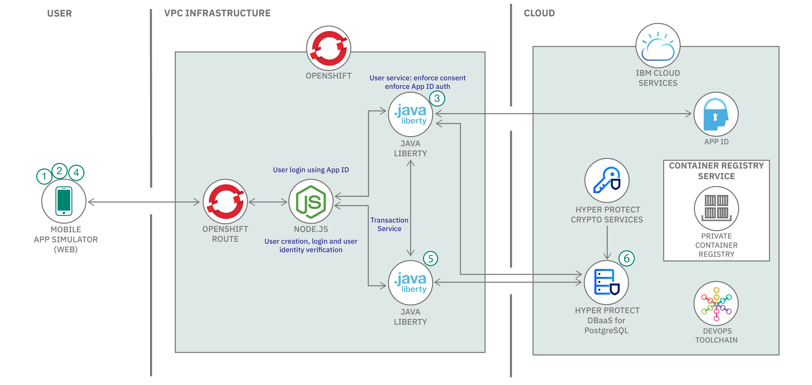
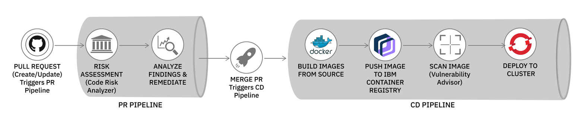

# Deploy a cloud-native application on IBM Cloud for Financial Services using Hyperprotect Services

In this code pattern, we show how to deploy a microservices based back-end in OpenShift 4.5 using IBM Cloud Toolchain CI/CD service. As part of the release of [IBM Cloud for Financial Services](https://developer.ibm.com/blogs/developer-introduction-to-ibm-cloud-for-financial-services) support for containerized applications, this code pattern shows how to use IBM Toolchain to create a Tekton pipeline that integrates IBM Code Risk Analyzer (CRA), IBM Container Registry and Vulnerability Advisor. CRA runs an infrastructure and deployment artifact scan against your GitHub repository as part of the an overall DevSecOps system.

In this code pattern, we will use IBM Cloud Hyper Protect DBaaS for PostgresSQL and Hyper Protect Crypot Services to encrypt and secure data. With IBM Cloud® Hyper Protect Crypto Services you can build solutions for you to bring and manage your own encryption keys in the cloud and use it with IBM Cloud Hyper protect DBaaS to store and access data securely. 

IBM Cloud® Hyper Protect Crypto Services is a single tenant key management service and hardware security module (HSM) based on IBM Cloud that supports industry standards such as PKCS #11. Its built on IBM LinuxONE technology.
With this service, client can create and own your master key (KYOK) that is used to control and manage the HSM. Using this IBM can't acess the client keys. Hyper Protect Crypto Services is also the only service in the cloud industry that is built on FIPS 140-2 Level 4-certified hardware.To read more about Hyper Protect Crypto Services, click [here](https://cloud.ibm.com/docs/hs-crypto?topic=hs-crypto-get-started).

Hyper Protect DBaaS for PostgreSQL provides PostgreSQL database clusters in the IBM Cloud. Each Hyper Protect DBaaS database cluster has one primary node and two secondary nodes (replicas that back up the primary).To read more about it, click [here](https://cloud.ibm.com/docs/hyper-protect-dbaas-for-postgresql?topic=hyper-protect-dbaas-for-postgresql-gettingstarted).

## Architecture

The example bank system includes several microservices for handling user authentication and transaction mechanics. It also uses IBM Hyper Protect DBaaS for PostgreSQL with IBM Hyper Protect Crypto services to protect data with envelope encryption.



## Deployment pipeline

The toolchain creates a pull request (PR) pipeline and a continuous delivery (CD) pipeline to conduct the risk assessment and deploy the application to OpenShift, as demonstrated in the following diagram.



## Included Components

- [IBM Managed OpenShift on VPC](https://www.ibm.com/cloud/openshift)
- [OpenLiberty](https://openliberty.io)
- [App ID](https://www.ibm.com/cloud/app-id)
- [Code Risk Analyzer](https://www.ibm.com/cloud/blog/announcements/find-source-code-vulnerabilities-with-code-risk-analyzer)
- [IBM Cloud Toolchain](https://www.ibm.com/cloud/architecture/toolchains/)
- [IBM Vulnerability Advisor](https://cloud.ibm.com/docs/Registry?topic=va-va_index)
- [Tekton - a Cloud Native CI/CD](https://tekton.dev/)
- [IBM Hyper Protect Crypto Services](https://www.ibm.com/cloud/hyper-protect-crypto)
- [IBM Hyper Protect DBaaS](https://www.ibm.com/cloud/hyper-protect-dbaas)

## Prerequisites

1. GitHub Account
2. Create an [IBM Cloud](https://cloud.ibm.com) account
3. Install [IBM Cloud CLI - ibmcloud](https://cloud.ibm.com/docs/cli?topic=cli-install-ibmcloud-cli)
4. Provision a [VPC](https://cloud.ibm.com/docs/vpc?topic=vpc-creating-a-vpc-using-the-ibm-cloud-console)
5. Provision an [OpenShift 4.x cluster on your VPC on IBM Cloud](https://cloud.ibm.com/docs/openshift?topic=openshift-clusters#clusters_vpcg2)
6. Create a service instance of [IBM Cloud Container Registry](https://cloud.ibm.com/registry/catalog)
7. Create a service instance of Hyper Protect Crypto Services
8. Create a service instance of IBM Cloud Hyper Protect DBaaS for PostgreSQL

## Steps

1. [Get the code](#1-get-the-code)
2. [Create a project in OpenShift Cluster](#2-create-a-project-in-openshift-cluster)
3. [Setup a namespace in Container Registry](#3-setup-a-namespace-in-container-registry)
4. [Configure App ID service](#4-configure-app-id-service)
5. [Create and load master keys for IBM Hyper Protect Crypto Service](#5-create-and-load-master-keys-for-ibm-hyper-protect-crypto-service)
6. [Create or add a root key in Hyper Protect Crypto Services](#6-create-or-add-a-root-key-in-hyper-protect-crypto-services)
7. [Grant service authorization](#7-grant-service-authorization)
8. [Setup IBM Cloud Hyper Protect DBaaS for PostgreSQL Database with Crypto service](#8-setup-ibm-cloud-hyper-protect-dbaas-for-postgresql-database-with-crypto-service)
9. [Create required secrets in OpenShift project](#9-create-required-secrets-in-openshift-project)
10. [Setup HyperProtect DBaaS for PostgreSQL](#10-setup-hyperprotect-dbaas-for-postgresql)
11. [Configure pipelines in IBM Cloud Toolchain](#11-configure-pipelines-in-ibm-cloud-toolchain)
12. [Deploy app using Toolchain](#12-deploy-app-using-toolchain)
13. [Access the application](#13-access-the-application)


### 1. Get the code

Clone the repository.

```
$ git clone https://github.com/IBM/example-bank-toolchain.git
```

In this code pattern, you will build toolchain to deploy the application so fork this repository in your GitHub account so that you can create and merge pull requests (PR).

### 2. Create a project in OpenShift Cluster

Create a project called `example-bank` in your OpenShift cluster if you don't have one already. 

### 3. Setup a namespace in Container Registry

If there is no namespace already exists or you want to setup a new, then create a namespace of any name using IBM Cloud Dashboard or using CLI as explained [here](https://cloud.ibm.com/docs/Registry?topic=Registry-getting-started).

### 4. Configure App ID service

Make sure you are logged in to your IBM Cloud account and that `ibmcloud` CLI is available.

We'll start by running a script provided under `scripts` directory in this repository to create a free instance of App ID in your IBM cloud account.  

```
$ cd scripts
$ ./createappid.sh

App ID instance created and configured
Management server: https://**.appid.cloud.ibm.com/management/v4/**
Api key:           YOUR_API_KEY
Auto-generated
appid-example-bank-credentials
```

Save the Management server and API key from above, they will be used in subsequent steps.

> Note: The README.md of the [example-bank repo](https://github.com/IBM/example-bank) describes the App ID creation and setup in more detail, if you want to learn how the script sets up this service.

### 5. Create and load master keys for IBM Hyper Protect Crypto Service

Before you can use your Hyper Protect Crypto Services instance, you need to first initialize your service instance (Crypto Units) by loading the master key. We will initialize your service instance by using key part files through IBM Cloud TKE CLI plug-in.

#### 1. Initialize your service instances

Before you begin make sure to install and update the IBM cloud Trusted Key Entry (TKE) CLI  plugin.

```bash
ibmcloud plugin install tke
## if you have already installed the TKE plugin
ibmcloud plugin update tke
```

Set the environment variable `CLOUDTKEFILES` on your workstation to specify the directory where you want to save the master key part files and signature key files. The signature keys are used to sign TKE administrative commands.
    
```bash
export CLOUDTKEFILES=<path>
#For example, you can specify the path to `/Users/tke-files`.
```

Then, login to IBM cloud using the following. 

```bash
ibmcloud target -r <region> -g <resource_group>
```

#### 2. Adding or removing crypto units that are assigned to service instances

Crypto units that are assigned to an IBM Cloud user account are in groups that are known as service instances. A service instance can have up to six operational crypto units.

Follow these [steps](https://cloud.ibm.com/docs/hs-crypto?topic=hs-crypto-initialize-hsm#initialize-crypto-prerequisites) in the following link below to initialize your service instance i.e. to add crypto units.

### 6. Create or add a root key in Hyper Protect Crypto Services

Go to your instance of Hyper Protect Crypto Services and [create a root key](https://cloud.ibm.com/docs/hs-crypto?topic=hs-crypto-create-root-keys) or [import an existing root key](https://cloud.ibm.com/docs/hs-crypto?topic=hs-crypto-import-root-keys).

### 7. Grant Service Authorization

Authorize Hyper Protect Crypto Services for use with Hyper Protect DBaaS for PostgreSQL service instances:

* Go to the IBM Cloud console.
* From the menu bar, click Manage > Access (IAM).
* In the side navigation, click Authorizations.
* Click Create.
* In the Source service menu, select Hyper Protect DBaaS for PostgreSQL.
* In the Source service instance menu, select All service instances.
* In the Target service menu, select Hyper Protect Crypto Services.
* In the Target service instance menu, select the service instance to authorize.
* Enable the Reader role.
* Click Authorize.


### 8. Setup IBM Cloud Hyper Protect DBaaS for PostgreSQL Database with Crypto service

When you create a Hyper Protect DBaaS for PostgreSQL service instance, select your Hyper Protect Crypto Services instance and root key.

The new Hyper Protect DBaaS for PostgreSQL service instance uses your Hyper Protect Crypto Services root key to encrypt your data. 


### 9. Create required secrets in OpenShift project

Run the following scripts using the fields from the App ID step:

```
 $ ./createsecrets-hyperprotect.sh <Management server> <API Key>
```

### 10. Setup HyperProtect DBaaS for PostgreSQL

#### Bank Database design

The database schema allows us to manage user profiles and track their transactions.


From the IBM Cloud Hyper Protect DBaaS for PostgreSQL, make sure to note the following

1. Hostname
2. Username - (usually its `admin`)
3. Password
4. DB Port

These will be used to create a Kubernetes secret that's used by all the services in the cluster.

#### Create Database instance and the secret for database credentials

To load the schema, we are going to use a `Job` Kubernetes resource. This allows a task to be run to completion to perform a task.

At this point we already have a PostgreSQL database with Crypto services for encryption. Now we will create a secret for your database credentials.

```
#  kubectl create secret generic bank-db-secret --from-literal=DB_SERVERNAME=<db_name> --from-literal=DB_PORTNUMBER=<db_port> --from-literal=DB_DATABASENAME=example --from-literal=DB_USER=<db_user> --from-literal=DB_PASSWORD=<db_password>

secret/bank-db-secret created
```

Verify the new secret appears in your project:

```
oc get secrets
bank-db-secret                     Opaque                                5         35s
```

#### Load the Database Schema

Build and deploy the image to load the database.

```
oc apply -f data_model/job.yaml
```

You can verify the successful deployment this way:

```
## Check status of the Jobs
$ oc get jobs
NAME                   COMPLETIONS   DURATION   AGE
cc-schema-load         1/1           29s        15m

$ oc get pods
NAME                    READY   STATUS      RESTARTS   AGE
cc-schema-load-xcfrs    0/1     Completed   0          15m

## Check logs for the job
$ oc logs cc-schema-load-xcfrs
CREATE EXTENSION
CREATE DATABASE
You are now connected to database "example" as user "postgres".
CREATE SCHEMA
SET
CREATE TABLE
CREATE TABLE
CREATE TABLE
```

### 11. Configure pipelines in IBM Cloud Toolchain

As explained above, we will create one toolchain with two pipelines - PR pipeline `pr-pipeline` and CD pipeline `cd-pipeline`.

#### PR Pipeline

PR Pipeline gets triggered automatically once a PR(pull request) is created or updated. In this pipeline, Code Risk Analyzer(CRA) is configured to scan the pull request. It discovers your code repo dependencies, such as application packages, container images, or operating system packages. CRA identifies if there are any vulnerabilities that are associated with the dependencies. After the scan it shares deployment configuration analysis, vulnerability report and bill of materials as comments in your pull request. CRA also sets status to the PR, so admin can set the gates to block changes that have security problems. 

#### CD Pipeline

CD Pipeline gets triggered automatically after merging of PR to deploy the updated app. This pipeline creates the container image using your Dockerfile, push the built image to IBM Cloud Container Registry, scan the image using vulnerability advisor in container registry and then deploy the service using the deployment configuration.

Follow the steps explained [here](configure-pipelines.md) to configure both pipelines.

### 12. Deploy app using Toolchain

- Go to your source code repo (the forked repository) in your GitHub account.
- Create a branch from the main branch. Make some changes in the code and create a pull request(PR).
- As soon as the PR is created, `pr-pipeline` will get triggered. Go to your toolchain, click on `pr-pipeline` card and it will take you to the pipeline dashboard as shown below. 

  
  
  Click on the name of pipelinerun to check more details about tasks as shown.
  
  

- Once `pipelinerun` is completed, verify the pipeline results which are posted as comments in the PR in the following sections.
	* IBM Cloud Continuous Delivery Deployment Configuration Analysis
	* IBM Cloud Continuous Delivery Bill of Materials
	* IBM Cloud Continuous Delivery Vulnerability Report

  CRA sets status to the PR also as shown.
   
   
  If it reports some risks/vulnerabilities, do fix those. It also tells the severity(low/medium/high) of the risk/vulnerability identified. You can decide if you want to fix all before merging PR. Fixing of code will result updating the PR and so `pr-pipeline` will get re-triggered.

- Once you get all good reports from CRA scan as shown below, you go ahead and merge PR.
  

- When you merge PR, it is like a commit is pushed to your code repo and then `cd-pipeline` will get triggered to deploy your application. You can check `pipelinerun` details through dashboard. Go to your toolchain, click on `cd-pipeline` card and it will take you to the pipeline dashboard.

  a. this pipeline creates image using the Dockerfile and uploads to IBM Container Registry(ICR).
  
    
  
  b. it runs image scan task using vulnerability advisor `va-scan` after uploading image to ICR. Image scan reports can be found either in task's log in Tekton Pipeline Dashboard or in ICR as shown.
  
   
  
  c. the pipeline provided in this repository is configured in such a way that it will not fail if vulnerability advisor reports some issues in images. To change this, update the following setting in pipeline `cd-pipeline.yaml` for image scan related tasks:
  ```
  - name: fail-on-scanned-issues
    value: 'false'
  ```
  
  d. it deploys the services on OpenShift.
  
 On completion of the pipeline-run, all services will be successfully deployed on OpenShift.

### 13. Access the application

Go to OpenShift Console. The `developers` view for project `example-bank` will show dashboard as:


Click on `mobile-simulator-deployment` and then click on its route OR get route using the command `oc get routes`.

Accessing the route will take you the simulator app which presents a Web based view of a mobile app run by a Node service running inside the OpenShift cluster. <br>

| | | | | |
|:-------------------------:|:-------------------------:|:-------------------------:|:-------------------------:|:-------------------------:|
|  1. Home screen |  1. Login screen |   2. Transactions dashboard  |   3. Analysis |   4. Account |

<strong>Home screen</strong><br>

The mobile simulator home screen has a fictitious banking application that the user can create accounts on. The other apps generates transactions for the chosen category. 

<strong>Login screen</strong><br>

From the dropdown menu inside the simulated phone app, pick one of the available accounts, and click **sign in** to see that user's point accumulation.

<strong>Transactions dashboard</strong><br>

This section shows transactions data for the logged in user.

<strong>Analysis</strong><br>

This sections shows how much the users spent on each category based on the transactions generated.

<strong>Account</strong><br>

From this page, the user can delete his data.

## Extensions 

**Erasure service**

You can add the ability to delete data on user's request. The erasure service is a Kubernetes `CronJob` that runs daily to anonymize data for users who have made a deletion request.  See the instructions for the erasure service at the [main pattern](https://github.com/IBM/example-bank/blob/main/README.md).

**Transaction  service**

You can also deploy OpenShift Serverless to enable the loyalty point feature. See details [here](https://github.com/IBM/example-bank/#process-transaction---serverless-application-knative-serving).

**LogDNA Integration**

You can connect the application with LogDNA to aggregate messages from the internal services and can keep track of any logs that are created within the application.

These features have been implemented already but not included as a part of toolchain. You can refer the [main pattern](https://github.com/IBM/example-bank/blob/main/README.md). branch of this repository for more details on this.

## License

This code pattern is licensed under the Apache License, Version 2. Separate third-party code objects invoked within this code pattern are licensed by their respective providers pursuant to their own separate licenses. Contributions are subject to the [Developer Certificate of Origin, Version 1.1](https://developercertificate.org/) and the [Apache License, Version 2](https://www.apache.org/licenses/LICENSE-2.0.txt).

[Apache License FAQ](https://www.apache.org/foundation/license-faq.html#WhatDoesItMEAN)

