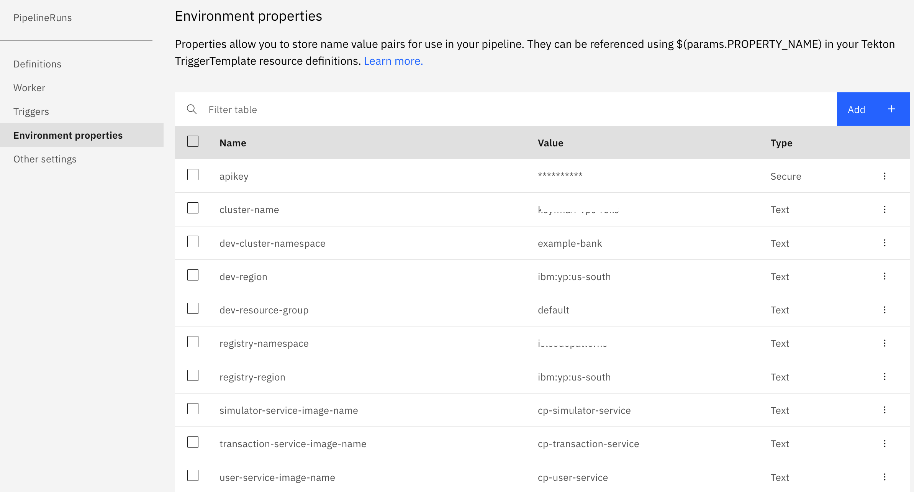

## Configuration of Pipelines

To deploy this application, we will create one toolchain with two pipelines - PR pipeline and CD pipeline.

#### PR Pipeline

PR Pipeline gets triggered automatically once a PR is created or updated. In this pipeline CRA is configured to scan the pull request. It discovers your code repo dependencies, such as application packages, container images, or operating system packages. CRA identifies if there are any vulnerabilities that are associated with the dependencies. After the scan it shares deployment configuration analysis, vulnerability report and bill of materials as comments in your pull request. CRA also sets `status` to the PR, so admin can set the gates to block changes that have security problems. 

#### CD Pipeline

CD Pipeline gets triggered automatically after merging of PR to deploy the updated app. This pipeline creates the container image using your Dockerfile, push the built image to IBM Cloud Container Registry, scan the image using vulnerability advisor in container registry and then deploy the service using the deployment configuration.

### Configure PR pipeline

Follow this [link](https://cloud.ibm.com/docs/ContinuousDelivery?topic=ContinuousDelivery-cd-configure-cra-repos#cra_build_toolchain) to build your own toolchain and configure CRA.

> Note: For the step `Adding GitHub to your toolchain`, provide the forked repository URL to monitor PR against that repo.

### Configure CD pipeline

- Go to the toolchain created in previous step.
- Click `Add tool` and choose `Delivery Pipeline`. Provide pipeline name as `cd-pipeline`, select pipeline type as `Tekton` and click on `Create Integration`.
- Click the `cd-pipeline` Delivery Pipeline card to open the Tekton Delivery Pipeline dashboard.
- In the Definitions section,

  a. Specify the Git repo and URL (https://github.com/open-toolchain/tekton-catalog) that contains the Tekton pipeline definition and related artifacts.

  b. Select the master branch.

  c. Add the `toolchain` path. This is the path to your pipeline definition within the Git repo.

  d. Click Validate and save your changes.

  e. Repeat steps a and b to add each of the following paths to the master branch within your Git repo:

    * `git`
    * `container-registry`
    * `kubernetes-service`

  f. Click Validate and save your changes.

- To add some more pipeline related artifacts from another repository, go again to the Definitions section and click `Add`.

  a. Specify the forked repository URL that contains the Tekton pipeline definition and related artifacts.

  b. Select the `toolchain` branch.

  c. Add the `toolchain-artifacts` path. This is the path to your pipeline definition within this Git repo.

  d. Click Validate and save your changes.
  
- In `Workers` section, select the worker as chosen in previous step.

- In the `Triggers` section, click `Add trigger` to create a new Git repository trigger to run. Specify the forked repository and `cra-fss` branch. Specify the events as `when a commit is pushed`. Associate the trigger with an event listener. Then, save your changes.

- In the `Environment Properties` section,

  a. click `Add` property, and then select `Secure`. Enter the `apikey` property key to use the API key created for previous pipeline.
  
  b. create the following properties one by one. Click `Add` property, and then select `Text`.
   
    ```
     cluster-name  -- name of your cluster created on VPC infra
     dev-cluster-namespace -- example-bank
     dev-region -- if region is us-south provide value as ibm:yp:us-south
     dev-resource-group -- name of your resource group say default
     registry-namespace -- name of the namespace created in ICR
     registry-region -- ibm:yp:us-south
     simulator-service-image-name -- container image name for simulator service
     transaction-service-image-name -- container image name for transaction service
     user-service-image-name -- container image name for user service
    ```
    
    After creating all properties, it will be visible as:
    
    
    
    With this configuration of pipelines is completed.
