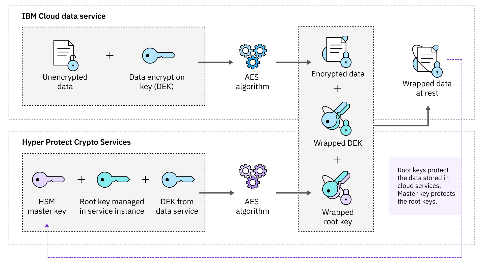
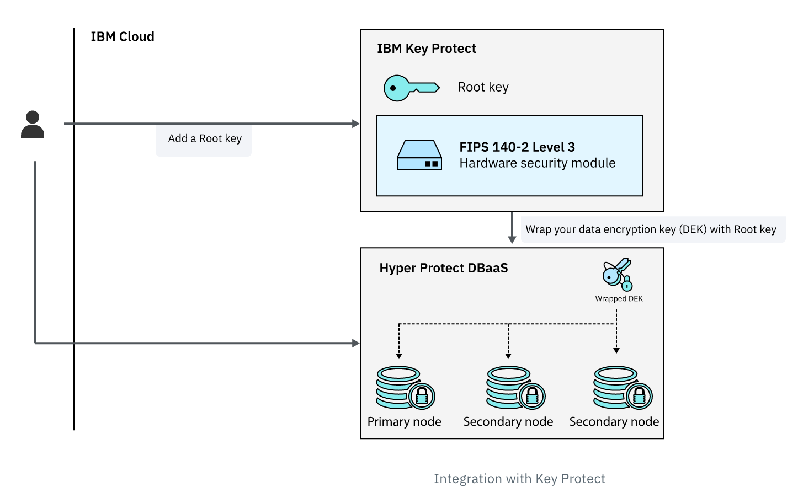
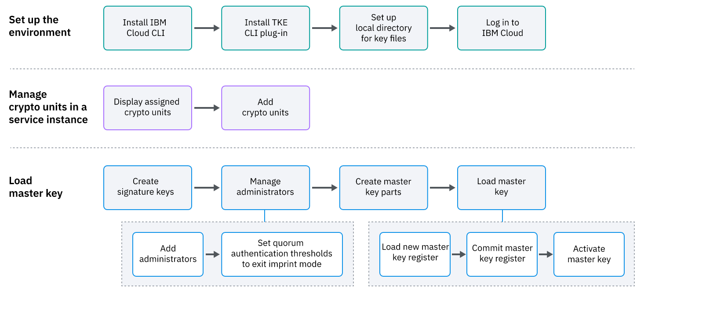

# Introduction to Hyper Protect Services

Security and compliance of data is critical when moving their sensitive application in the cloud. Most of the organizations in regulated industries such as finance, cited security, privacy, compliance and regulatory concerns. To address these concerns we are talking about `three pillars` of data security when considering end-to-end data protection. `Data at rest`  and `Data in flight` are the first two pillars which most industries have addressed these concerns. However, when regulated industries such as finance, government agencies etc.. bring their application and data to IBM Cloud, they want to process sensitive data with highest level of security without compromising the performance and latency. The focus of confidential computing is to protect the sensitive data when `data is in use or in memory`.

To overcome these concerns, the IBM Cloud Hyper Protect Services, including Crypto Services, Virtual Servers, and DBaaS (Database-as-a-Service) offer provide protection to all three pillars thereby providing end-to-end confidential computing environment in the IBM Cloud. The 3 pillars of data that is protected by above mentioned Hyper Protect Services are: 

1. Data at rest
1. Data in flight
1. Data in use or memory

IBM cloud combines key management services and Hyper Protect DBaaS, to not only encrypt and store data, but also provides mechanisms to protect the keys that are used to encrypt the data. The three main services that helps in end-to-end data protection are;
* IBM Key Protect
* IBM Hyper Protect Crypto Services
* IBM Hyper Protect DBaaS (Postgres and MongoDB)

Sensitive data should not be stored unencrypted on any cloud provider. But the trick is not just ot encrypt data but also protect the keys or ciphers that is used to encrypt and decrypt the data. It is possible to set up on-premise HSMs to manage data but these machines are expensive to establish and manage. 

Cloud-based storage, where encrypted data must be accessible at scale and at speed from a variety of permissioned actors, is less expensive, but has its own difficulties. How can you be sure that the data is secure when the key used to encrypt it (what's known as a "data encryption key") could exist on dozens if not hundreds of computers spread all over the world? In that scenario, your data is only as secure as the computers and connections of those with the data encryption key.

The solution is to use key management services like Key Protect, hyper protect crypto services, which keeps data secure by encrypting the data encryption keys (DEKs) that encrypt your plaintext data with root keys managed by IBM via an impenetrable HSM. In this kind of a system, known as "envelope encryption", the process of decrypting the data means first "unwrapping" the encrypted DEK (opening its envelope, in other words) and then using the DEK to decrypt the data. Along with the key management services IBM Cloud offers Hyper Protect DBaaS to not only protect keys to wrap the encryption keys but also to store encrypted data providing end-to-end protection.

## Envelope Encryption

IBM Key protect and Hyper protect Crytpo services uses [envelope encryption](https://cloud.ibm.com/docs/hs-crypto?topic=hs-crypto-envelope-encryption) to protect data. Envelope encryption is a practice of encrypting data with a data encryption key (DEK) and then wrapping the DEK with a root key that you can fully manage. Root keys that are managed in a Hyper Protect Crypto Services service instance are also encrypted by the master key, that is created during the key ceremony, which ensures you full control of the entire key hierarchy. 

In Key Protect the root key wraps data encryption key (DEK) where as in hyper protect crypto services the master key protects the root key, which is used to wrap DEK providing extra layer of security.

## IBM Key Protect and Bring-Your-Own-Key (BYOK)

IBM® Key Protect for IBM Cloud™ is a full-service encryption solution that allows data to be secured and stored in IBM Cloud using the latest envelope encryption techniques that leverage FIPS 140-2 Level 3 certified cloud-based hardware security modules (HSM).

IBM Cloud Key Protect is a multi-tenant Key Management Service (KMS) where customers bring their keys to the Cloud (BYOK) and manage them using IBM-controlled HSM, and IBM provides operational assurance that IBM will not access the keys. Hence the master key that is used to wrap the root keyys is owned by IBM.

## IBM Hyper Protect Crypto Servicesand Keep-Your-Own-Key (KYOK)

KYOK with Hyper Protect Crypto Services offers two-in-one (i.e., a KMS with built-in Hardware Security Module (HSM)). The offer is a single-tenant Key Management Service with key vaulting provided by customer-controlled FIPS 140-2 Level 4 (the highest available certification) HSMs.

With Hyper Protect Crypto Services, customers keep their keys protected by the HSMs they control and manage, the implementation provides technical assurance that IBM cannot access the keys. IBM Hyper Protect Crypto Services is built on IBM LinuxONE technology. The HSM in Hyper Protect is single-tenant and the tenant owns the master key, which is created in the key ceremony from multiple key parts supplied by the customer (KYOK).

## Key Ceremony in Hyper Protect Crypto Services (KYOK)

Key ceremony is a process of loading your own master key to your service instance (cloud account). 

Hyper Protect Crypto Services sets up signature keys for crypto unit administrators during the service initialization process to ensure that the master key parts are loaded to the HSM with no interception.

A master key is composed of at least two master key parts. Each master key custodian owns one encrypted master key part. In most cases, a master key custodian can also be a crypto unit administrator. In order to load the master key to the service instance, master key custodians need to load their key parts separately using their own administrator signature keys.

A signature key is composed of an asymmetric key pair. The private part of the signature key is owned by the crypto unit administrator, while the public part is placed in a certificate that is used to define an administrator and never leaves the crypto unit.

This design ensures that no one can get full access of the master key, even the crypto unit administrators.

Using IBM TKE CLI plugin with IBM cloud CLI clients can create crypto units, add signatures, and load master key parts, commit and activate them.

## Securing your data in Hyper Protect DBaaS for PostgreSQL

[IBM Cloud® Hyper Protect DBaaS for PostgreSQL](https://cloud.ibm.com/docs/hyper-protect-dbaas-for-postgresql?topic=hyper-protect-dbaas-for-postgresql-data-security) is a public multi-tenant cloud database as a service. It implements security protections at all levels, including workload isolation, data encryption (Bring-Your-Own-Key or Keep-Your-Own-Key), and identity and administration access control, to ensure that your data is protected in a multi-tenancy environment. 

Hyper Protect DBaaS for PostgreSQL uses the following methods to protect your data.

* Built on IBM Secure Service Container technology
* All Hyper Protect DBaaS for PostgreSQL connections use TLS/SSL encryption for data in transit. The current supported version of this encryption is TLS 1.2.
* Access to the IBM Cloud account, Hyper Protect DBaaS for PostgreSQL management web user interface, CLI, and API is secured via IBM Cloud Identity and Access Management (IAM).
* Access to the database is secured and managed through the standard access controls provided by the database. All database access controls are unavailable in the service interfaces. IAM users are not able to authenticate to the database itself. This separation provides a higher isolation for your environment.
* All Hyper Protect DBaaS for PostgreSQL storage is provided on storage encrypted with LUKS using AES-256. The default keys are managed within the locked down environment within Secure Service Containers. Bring Your Own Key (BYOK) for encryption is also available through IBM Key Protect, and Keep Your Own Key (KYOK) through IBM Cloud Hyper Protect Crypto Services.

