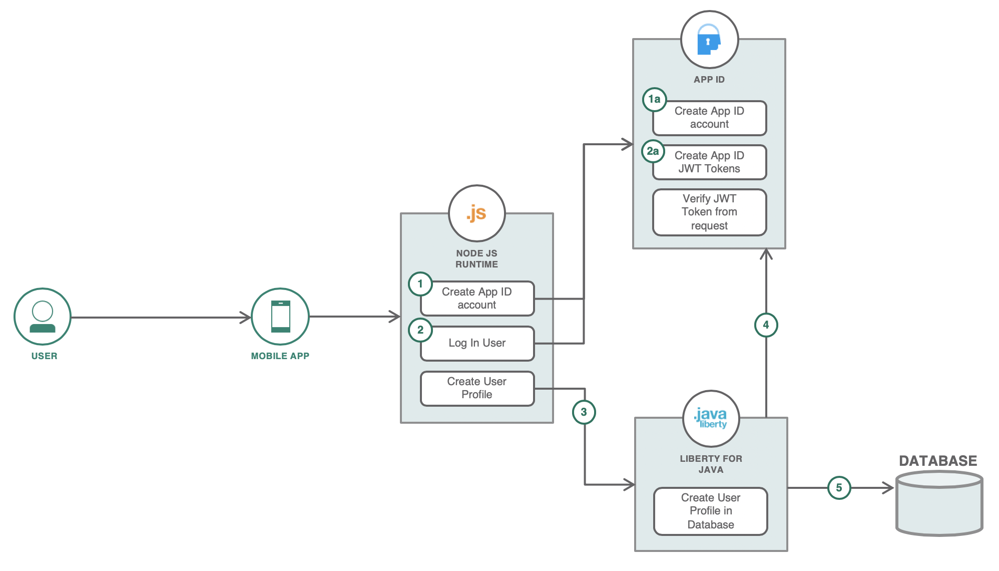

## User authentication

1. The user creates an account using the mobile app simulator. This hits an API from the nodejs server. The nodejs server then hits an API from the App ID service that would create the user's account in its own cloud directory.
2. The mobile app simulator then logs in the user after account creation. The App ID service then creates valid access tokens and ID tokens for the user. The mobile app stores these tokens for later use in authentication.
3. Using the access token from the previous step, the mobile app can now successfully call the protected APIs in the Liberty microservice. The mobile app calls the API with the access token in the authorization header to create the user profile in the database.
4. The Liberty service is integrated with the App ID instance. This verifies the access token in the authorization header from the request.
5. When the token is valid, the user profile is created in the database. The access token contains the user ID of the user that sent the request.

### Auth token flow with AppId as identity provider and Liberty's use of token to authenticate users:

The Liberty microservices are protected APIs that require authorization headers. If the request does not have one, it will not allow the request to be processed, thus sending a 401 Unauthorized response. The microservices makes use of a managed identity provider, App ID for this authentication. This makes it easier to protect APIs and manage identity information of users.

The mobile app simulator is integrated with the App ID instance and whenever a user logs in, the app receives access tokens and stores them for later use in requests to the protected APIs. The tokens expire in an hour by default which would require users to authenticate again after expiration.

Whenever a request with a token in the authorization header is sent, the Liberty microservice uses the App ID integration to make sure that the token is valid. Then it continues to process the request. The liberty microservice also makes use of the subject ID or user ID in the token to identify which user is making the request. For example, when a user asks for his number of points earned, it needs to pull the right profile from the database. This is where the user ID in the token payload can be made use of.
